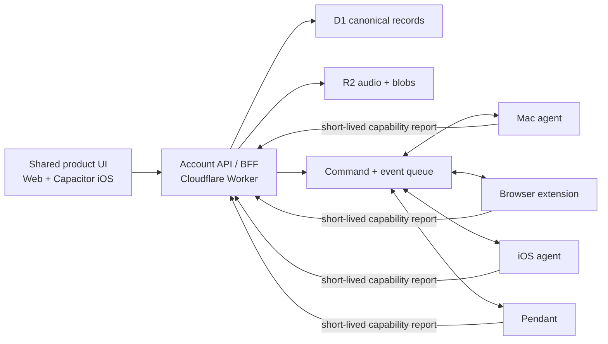

# Product UI and data architecture

## Decision

The AI Pendant should have one account-scoped product experience across web and
iOS. Device agents are execution peers, not separate products.

- **Dashboard** becomes the shared product shell: home, conversations,
  runs, memory, devices, and settings.
- **Web** and **Capacitor iOS** consume the same React feature packages and the
  same cloud API contracts.
- The **Mac agent**, **browser extension**, **iOS agent**, and **pendant** expose
  capabilities, presence, permissions, and diagnostics. They do not each own a
  competing dashboard or session database.
- A local Mac diagnostics page may remain for private raw logs, audio previews,
  and recovery while offline. It is a device tool reached from Mission
  Control's Devices page, not the canonical dashboard.

## Current state

| Surface | Current source | Current authority | Problem |
| --- | --- | --- | --- |
| Dashboard | `software/ai-pendant-dashboard` | D1 jobs plus a bounded `agent-snapshot` copied from the Mac | Hardware-focused view; not the full product |
| Local Ops dashboard | `software/ai-pendant-simulator/src/ops` | Mac JSON files and local agent APIs | Fullest UI, but tied to one Mac and duplicated remotely through an RPC proxy |
| Pendant controller / Capacitor | `software/ai-pendant-simulator/src` | Browser localStorage in mock mode, Mac or relay otherwise | Separate shell and session cache; diverges from web |
| Local Mac agent | `software/ai-pendant-simulator/local-agent` | Device-local permissions, execution, logs, and JSON stores | Product records are still authored and stored primarily on one Mac |
| Cloudflare relay | Worker plus D1 | Devices, jobs/runs, and generic state blobs | D1 is persistent, but product data is not normalized or account-partitioned |

Cloudflare is not a single server/database object. The Worker is the API and
coordination server, D1 is the relational database, and R2 should hold audio and
other large immutable blobs.

The current `agent-snapshot` D1 record improves remote availability, but it is a
last-known telemetry/read cache, not canonical product state. There is no
cloud-to-Mac restore or merge path, and the deployed dashboard currently exposes
only its status, pipeline, and log subset. It does not provide record-level
conflict handling, per-account authorization, pagination, offline mutation
replay, or durable multi-device writes.

## Target boundaries

### Canonical cloud data

D1 is authoritative for:

- accounts, authenticated identities, and account membership;
- registered devices and revocable device credentials;
- conversations, sessions, and turns;
- agent runs, run events, approvals, and results;
- shared memory entities, relations, revisions, and user settings;
- capability report metadata and last-seen presence;
- idempotency keys and the mutation/sync event log.

R2 is authoritative for:

- input recordings and generated speech;
- log bundles explicitly uploaded by the user;
- large attachments and immutable artifacts.

D1 stores an account-scoped R2 object key, media metadata, retention state, and
checksum. It should not store Base64 audio inside JSON job records.

An additive normalized schema can use these ownership boundaries:

| D1 table | Primary identity | Important relationships |
| --- | --- | --- |
| `accounts`, `account_members` | `account_id`, identity provider subject | Every product query resolves an account membership first |
| `devices`, `device_credentials` | `account_id + device_id` | Credentials are hashed, scoped, rotated, and revocable |
| `device_capability_reports` | `account_id + device_id + sequence` | Reports expire; a later sequence supersedes an earlier report |
| `sessions`, `turns` | `account_id + session_id`, then `turn_id` | Turns are append-only and retain `source_device_id` |
| `runs`, `run_events` | `account_id + run_id`, then `event_id` | A run may reference a session and the device that originated it |
| `memory_entities`, `memory_relations` | account-scoped stable IDs | Revisions support explicit edit conflicts |
| `media_objects` | `account_id + media_id` | Contains the R2 key, checksum, content type, size, and retention policy |
| `mutations` | `account_id + mutation_id` | Stores the result needed to make client retries idempotent |
| `sync_events` | account-scoped monotonic revision | Feeds incremental web/iOS/Mac synchronization |

### Device-local authoritative data

The executing device remains authoritative for facts the cloud cannot grant or
inspect directly:

- macOS Accessibility, Screen Recording, Automation, and app-specific TCC state;
- iOS microphone, speech, notifications, background mode, and local-network
  permissions;
- browser extension host permissions, active connection, and supported browser
  actions;
- installed agent version, platform details, and locally available tools;
- raw device logs and sensitive machine diagnostics unless explicitly uploaded.

Each agent publishes a short-lived
`device-agent-report.v1` record. Expired reports make the device offline;
silence is never interpreted as permission granted.

### Caches and outboxes

These stores improve responsiveness but are not canonical:

- browser IndexedDB for the last product snapshot, optimistic mutations, and UI
  preferences;
- iOS SQLite for the same snapshot plus a durable background outbox;
- Mac JSON/SQLite for queued commands, recent product data, and an upload
  outbox;
- extension storage for its device credential, endpoint, and last capability
  report;
- localStorage only for non-sensitive presentation preferences.

Every mutation carries `accountId`, a stable resource ID, a client-generated
`mutationId`, and the last observed revision. Retrying a mutation is safe.

## Stable identity model

| Identifier | Meaning | Created by | Lifetime |
| --- | --- | --- | --- |
| `accountId` | Security and data partition | Account service | Account lifetime |
| `deviceId` | One physical/browser installation | Pairing service | Until revoked/reset |
| `agentId` | One installed execution agent | Device registration | Until reinstall/rekey |
| `sessionId` | One conversation | Cloud API or offline client UUID | Persistent |
| `runId` | One agent invocation | Cloud API or offline client UUID | Persistent |
| `mutationId` | One idempotent write | Originating client | Retained for deduplication |

Paths, hostnames, display names, and Node executable locations are diagnostics,
not identities.

During migration, preserve existing `sessionId` values. Treat the current D1
job `jobId` and local `pipelineId` as aliases for the target `runId` until
producers emit `runId` directly. Pair each existing installation once to assign
a stable `deviceId`; never derive it from `BRIDGE_DEVICE_ID`, a folder, the
Node path, or a browser tab.

## Shared client boundary

Create a pure React package for navigation, feature components, queries, and
view models. It must not import Next server routes, Capacitor plugins, Node APIs,
or localhost URLs.

Thin adapters provide platform-specific services:

| Adapter | Web | Capacitor iOS |
| --- | --- | --- |
| Authentication | Browser session / passkey redirect | Sign in with Apple and secure token storage |
| Cache | IndexedDB | SQLite |
| Audio capture/playback | Web Media APIs | Capacitor/native plugin |
| Notifications | Web push | APNs |
| Local device handoff | Extension or localhost discovery | Native device agent |

The deployed dashboard can keep server-side API routes as a backend-for-frontend,
but the shared React package calls a transport interface rather than those route
modules directly. Capacitor calls the same account API using its native session.

The existing Vite local Ops page should first become a compatibility consumer
of those shared view models. Once feature parity is reached, `/dashboard` on the
Mac can show a small diagnostics-only page or open the Dashboard with the
paired `deviceId`.

## Capability and permission reports

Use `software/ai-pendant-contracts` for the versioned shapes. A capability entry
separates:

- `availability`: whether the tool actually works now;
- `permission`: whether the host permission is granted, denied, pending, or not
  applicable;
- `scope`: device, agent process, browser, or app;
- `detail`: remediation suitable for display.

This prevents misleading states such as "Mac connected" while the process lacks
Accessibility, or "browser available" while no extension is connected.

## Incremental migration

1. **Freeze contracts.** Adopt `product-snapshot.v1` and
   `device-agent-report.v1` at every boundary. Add contract fixtures to relay,
   dashboard, Mac, extension, and iOS tests before moving UI.
2. **Introduce account scope.** Create one initial owner account, associate all
   current devices, and require the authenticated account on every D1 query.
   Replace global relay credentials in end-user clients with revocable,
   least-privilege user/device sessions.
3. **Add normalized D1 and R2 storage.** Add account, device, session, turn, run,
   run-event, memory, media, mutation, and capability-report tables. Keep the
   current job/state tables during migration.
4. **Backfill without downtime.** Import `pendant-sessions.json`, context graph,
   run history, and metadata from the Mac. Upload retained audio to R2. Preserve
   existing IDs; generate deterministic import `mutationId` values so reruns do
   not duplicate data.
5. **Dual-write and verify.** For a release, write new activity to normalized
   D1 and the legacy Mac stores. Compare counts, revisions, and representative
   records. Read from D1 with a temporary fallback to `agent-snapshot`.
6. **Expose product APIs.** Provide account-scoped snapshot, session, run,
   memory, device, capability, and media endpoints. Keep `/v1/ops/proxy` only
   for device-local diagnostics/actions that cannot be cloud records.
7. **Extract the shared React product UI.** Move feature components and view
   models from the Dashboard and Ops into one client package. Render it in the
   deployed web shell and Capacitor. Move hardware telemetry into a Runs detail
   view and Mac status into Devices.
8. **Add offline synchronization.** Queue iOS/web mutations locally, replay with
   idempotency keys, merge append-only turns/events, and use explicit revision
   conflicts for editable titles/settings/memory.
9. **Retire duplicate ownership.** Stop treating browser localStorage and Mac
   JSON as session authorities. Reduce the localhost dashboard to diagnostics
   and remove duplicate product panels after telemetry confirms cloud reads and
   writes are complete.

## Acceptance criteria

- Opening web and iOS under the same account shows the same sessions, runs,
  memory, device list, and settings after sync.
- A command created offline appears once after reconnecting.
- Restarting or replacing the Mac agent does not erase product history.
- Device permission changes appear independently for each stable `deviceId`.
- The product UI does not require the Mac to be online for historical reads.
- Raw Mac logs remain local unless the user explicitly uploads a diagnostic
  bundle.
- Removing the browser extension or revoking a device makes only that
  capability unavailable; it does not affect account data.
