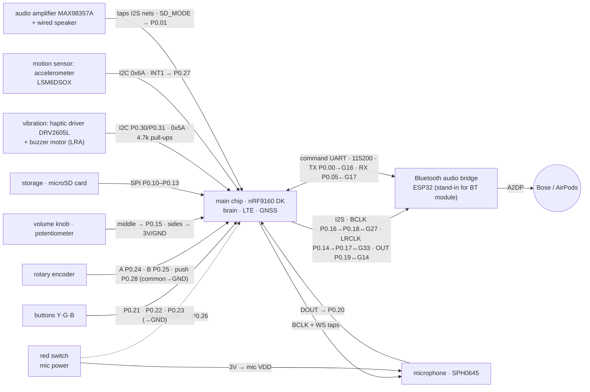

# AI Pendant — Master Breadboard Wiring (the whole circuit)

THE single source of truth for every wire on the bench. `firmware/CONTROLS_WIRING.md`
keeps the deep rationale for the controls; this file is the complete net list.
Any agent that changes a pin updates THIS file in the same commit.

Status legend: **[LIVE]** wired & firmware-verified · **[NOW]** wire it, firmware flashed/landing ·
**[PEND]** pin proposed, awaiting sensors-fw build confirmation · **[FUT]** planned (task #22).

## Topology (renders on GitHub)

## Power and ground

| Net | From | To | Status |
| --- | --- | --- | --- |
| 3V rail | nRF DK **VDD/3V** pin | breadboard red rail | [LIVE] |
| GND rail | nRF DK **GND** | breadboard black rail | [LIVE] |
| **Common ground** | ESP32 **GND** | same black rail | [LIVE] — I2S dies without it |
| ESP32 power | Mac USB → ESP32 micro-USB | — | [LIVE] |
| Mic power | red rail → **red latching switch** → SPH0645 **3V** | switch in series | [NOW] |

## Audio nets (I2S + clocks) — the heart

| Net | Members (all on the same wire) | Status |
| --- | --- | --- |
| BCLK | nRF **P0.16** (PWM out) → jumper → nRF **P0.18** · ESP32 **GPIO27** · SPH0645 **BCLK** · MAX98357A **BCLK** [PEND] | [LIVE] |
| LRCLK | nRF **P0.14** (PWM out) → jumper → nRF **P0.17** · ESP32 **GPIO33** · SPH0645 **LRCL/WS** · MAX98357A **LRC** [PEND] | [LIVE] |
| Audio out | nRF **P0.19** (SDOUT) → ESP32 **GPIO14** · MAX98357A **DIN** [PEND] | [LIVE] |
| Mic data | SPH0645 **DOUT** → nRF **P0.20** (SDIN, internal pull-down) | [LIVE] |
| Mic slot | SPH0645 **SEL** → GND | [LIVE] |

## Controls (firmware flashed 2026-08-12)

| Control | Pin | Other leg | Status |
| --- | --- | --- | --- |
| Yellow button (talk) | nRF **P0.21** | GND | [NOW] |
| Green button (memo) | nRF **P0.22** | GND | [NOW] |
| Blue button (push-to-talk: press=ask, press=send) | nRF **P0.23** | GND | [NOW] — remapped from approve/deny 2026-08-12 |
| Encoder A / B | nRF **P0.24** / **P0.25** | encoder COMMON (middle) → GND | [NOW] |
| Encoder push | nRF **P0.28** | GND | [NOW] |
| Mic-power sense | mic-VDD node → **100k** → nRF **P0.26** | no pull | [NOW] |
| Volume pot middle leg | nRF **P0.15** (AIN2) | side legs → 3V rail and GND | [NOW] — firmware flashed |

## microSD breakout (SPI) — existing

| Signal | Pin |
| --- | --- |
| CS | nRF **P0.10** |
| DI (MOSI) | nRF **P0.11** |
| DO (MISO) | nRF **P0.12** |
| CLK | nRF **P0.13** |
| VCC / GND | 3V rail / GND rail |

## I2C bus — incoming (sensors-fw)

Bus: **SDA P0.30 · SCL P0.31**, one **4.7k pull-up from each to the 3V rail** [NOW].

| Device | Connections | Status |
| --- | --- | --- |
| DRV2605L haptic (addr 0x5A) | VDD→3V, GND, SDA, SCL, OUT+/OUT− → LRA buzzer | [NOW] — firmware flashed |
| Accelerometer **LSM6DSOX** (addr 0x6A) | VDD→3V, GND, SDA, SCL, **INT1 → P0.27** | [NOW] — firmware flashed |

## Speaker amp — incoming

| MAX98357A pin | Goes to | Status |
| --- | --- | --- |
| VIN / GND | 3V rail / GND | [NOW] |
| BCLK / LRC / DIN | the BCLK / LRCLK / Audio-out nets above (parallel taps) | [NOW] |
| SD_MODE | nRF **P0.01** (speaker on/off gate; P0.29 became console TX) | [NOW] |
| OUT+ / OUT− | wired speaker (+ → OUT+) | [NOW] |

## nRF commands the Bluetooth chip — TWO NEW JUMPER WIRES

The nRF9160 owns Bluetooth policy (which speaker, when); the ESP32 obeys, on
the one interface a real Bluetooth module has. **115200 8N1, no flow
control.** Add exactly these two wires:

| Wire | From | To | Status |
| --- | --- | --- | --- |
| Command TX | nRF **P0.00** | ESP32 **GPIO16** (RX2) | [NOW] |
| Command RX | ESP32 **GPIO17** (TX2) | nRF **P0.05** | [NOW] |

Both ends already share the GND rail (the common-ground wire the I2S bus
needs) — do **not** add a second ground.

**Board-controller dependency.** Flash the DK's nRF52840 board controller
with this repo's `firmware/nrf9160/boards/nrf9160dk_nrf52840.overlay`, which
disables `vcom2_pins_routing` **and** `led4_pin_routing`. Without it the
interface MCU drives P0.00 (fighting the nRF's TX on every start bit) and
the on-board LED4 hangs on the RX line. **Cost of the RX pin: DK LED4 is no
longer usable** — the firmware only ever drives LED1 (P0.02), and P0.03/P0.04
stay free for a future second indicator.

## Off-board

- nRF DK ← Mac USB (J-Link flash + debug, serial 960036581)
- ESP32 ← Mac USB (`/dev/cu.usbserial-0287A9CA`, serial JSON control)
- ESP32 → Bose SLIII / AirPods over Bluetooth A2DP

## Per-component pinout — every pin, where it goes

Label names as printed on each breakout. "—" = leave unconnected.

**microphone · SPH0645**
| pin on part | connect to |
| --- | --- |
| 3V | red switch OUT (switched power) |
| GND | GND rail |
| BCLK | BCLK net (DK P0.18 node) |
| LRCL | LRCLK net (DK P0.17 node) |
| DOUT | DK P0.20 |
| SEL | GND rail |

**red latching switch** (2 terminals)
| terminal | connect to |
| --- | --- |
| 1 | 3V rail |
| 2 | mic 3V pin, AND 100k resistor → DK P0.26 |

**buttons** (2 wires each)
| button | wire 1 | wire 2 |
| --- | --- | --- |
| yellow (talk) | DK P0.21 | GND rail |
| green (memo) | DK P0.22 | GND rail |
| blue (push-to-talk) | DK P0.23 | GND rail |

**rotary encoder** (3 pins one side, 2 the other)
| pin on part | connect to |
| --- | --- |
| A (outer) | DK P0.24 |
| C (middle) | GND rail |
| B (outer) | DK P0.25 |
| switch pin 1 | DK P0.28 |
| switch pin 2 | GND rail |

**volume knob · potentiometer** (3 legs)
| leg | connect to |
| --- | --- |
| left | 3V rail |
| middle | DK P0.15 |
| right | GND rail |

(volume backwards? swap left/right)

**storage · microSD breakout**
| pin on part | connect to |
| --- | --- |
| 3V | 3V rail |
| GND | GND rail |
| CLK | DK P0.13 |
| DO | DK P0.12 |
| DI | DK P0.11 |
| CS | DK P0.10 |
| 5V, CD | — |

**vibration · DRV2605L haptic driver**
| pin on part | connect to |
| --- | --- |
| VIN | 3V rail |
| GND | GND rail |
| SCL | DK P0.31 (+ 4.7k → 3V rail, once per bus) |
| SDA | DK P0.30 (+ 4.7k → 3V rail, once per bus) |
| OUT+ | buzzer motor wire 1 |
| OUT− | buzzer motor wire 2 |
| IN | — |

**motion sensor · LSM6DSOX accelerometer**
| pin on part | connect to |
| --- | --- |
| VIN | 3V rail |
| GND | GND rail |
| SCL | DK P0.31 (same bus wire as haptic) |
| SDA | DK P0.30 (same bus wire as haptic) |
| INT1 | DK P0.27 |
| DO, CS, INT2, I1(3V3) | — (DO low = address 0x6A) |

**audio amplifier · MAX98357A**
| pin on part | connect to |
| --- | --- |
| VIN | 3V rail |
| GND | GND rail |
| BCLK | BCLK net (same wire as ESP32 GPIO27) |
| LRC | LRCLK net (same wire as ESP32 GPIO33) |
| DIN | audio-out net (same wire as ESP32 GPIO14) |
| SD | DK P0.01 |
| GAIN | — (open = 9 dB) |
| + terminal | speaker + (marked/red wire) |
| − terminal | speaker − |

**Bluetooth bridge · ESP32 HUZZAH32**
| pin on board | connect to |
| --- | --- |
| GPIO27 | BCLK net |
| GPIO33 | LRCLK net |
| GPIO14 | audio-out net |
| GPIO16 (RX2) | DK P0.00 — command UART in |
| GPIO17 (TX2) | DK P0.05 — command UART out |
| GND | GND rail (the common-ground wire) |
| micro-USB | Mac (debug console only — same command set, nothing depends on it) |

**main chip · nRF9160 DK board itself**
| pin | connect to |
| --- | --- |
| VDD | 3V (red) rail |
| GND | GND (black) rail |
| P0.16 → P0.18 | jumper on the DK (clock) |
| P0.14 → P0.17 | jumper on the DK (clock) |
| P0.00 | ESP32 GPIO16 — command UART TX (needs `vcom2_pins_routing` disabled) |
| P0.05 | ESP32 GPIO17 — command UART RX (needs `led4_pin_routing` disabled; costs DK LED4) |
| micro-USB | Mac (flash + debug) |
