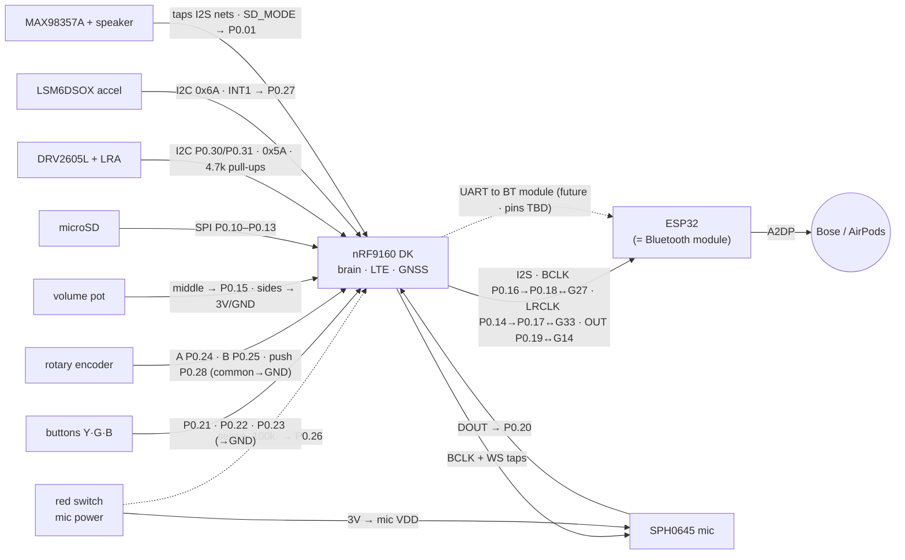

# AI Pendant — Master Breadboard Wiring (the whole circuit)

THE single source of truth for every wire on the bench. `firmware/CONTROLS_WIRING.md`
keeps the deep rationale for the controls; this file is the complete net list.
Any agent that changes a pin updates THIS file in the same commit.

Status legend: **[LIVE]** wired & firmware-verified · **[NOW]** wire it, firmware flashed/landing ·
**[PEND]** pin proposed, awaiting sensors-fw build confirmation · **[FUT]** planned (task #22).

## Topology (renders on GitHub)

## Power and ground

| Net | From | To | Status |
| --- | --- | --- | --- |
| 3V rail | nRF DK **VDD/3V** pin | breadboard red rail | [LIVE] |
| GND rail | nRF DK **GND** | breadboard black rail | [LIVE] |
| **Common ground** | ESP32 **GND** | same black rail | [LIVE] — I2S dies without it |
| ESP32 power | Mac USB → ESP32 micro-USB | — | [LIVE] |
| Mic power | red rail → **red latching switch** → SPH0645 **3V** | switch in series | [NOW] |

## Audio nets (I2S + clocks) — the heart

| Net | Members (all on the same wire) | Status |
| --- | --- | --- |
| BCLK | nRF **P0.16** (PWM out) → jumper → nRF **P0.18** · ESP32 **GPIO27** · SPH0645 **BCLK** · MAX98357A **BCLK** [PEND] | [LIVE] |
| LRCLK | nRF **P0.14** (PWM out) → jumper → nRF **P0.17** · ESP32 **GPIO33** · SPH0645 **LRCL/WS** · MAX98357A **LRC** [PEND] | [LIVE] |
| Audio out | nRF **P0.19** (SDOUT) → ESP32 **GPIO14** · MAX98357A **DIN** [PEND] | [LIVE] |
| Mic data | SPH0645 **DOUT** → nRF **P0.20** (SDIN, internal pull-down) | [LIVE] |
| Mic slot | SPH0645 **SEL** → GND | [LIVE] |

## Controls (firmware flashed 2026-08-12)

| Control | Pin | Other leg | Status |
| --- | --- | --- | --- |
| Yellow button (talk) | nRF **P0.21** | GND | [NOW] |
| Green button (memo) | nRF **P0.22** | GND | [NOW] |
| Blue button (approve / hold=deny) | nRF **P0.23** | GND | [NOW] |
| Encoder A / B | nRF **P0.24** / **P0.25** | encoder COMMON (middle) → GND | [NOW] |
| Encoder push | nRF **P0.28** | GND | [NOW] |
| Mic-power sense | mic-VDD node → **100k** → nRF **P0.26** | no pull | [NOW] |
| Volume pot middle leg | nRF **P0.15** (AIN2) | side legs → 3V rail and GND | [NOW] — firmware flashed |

## microSD breakout (SPI) — existing

| Signal | Pin |
| --- | --- |
| CS | nRF **P0.10** |
| DI (MOSI) | nRF **P0.11** |
| DO (MISO) | nRF **P0.12** |
| CLK | nRF **P0.13** |
| VCC / GND | 3V rail / GND rail |

## I2C bus — incoming (sensors-fw)

Bus: **SDA P0.30 · SCL P0.31**, one **4.7k pull-up from each to the 3V rail** [NOW].

| Device | Connections | Status |
| --- | --- | --- |
| DRV2605L haptic (addr 0x5A) | VDD→3V, GND, SDA, SCL, OUT+/OUT− → LRA buzzer | [NOW] — firmware flashed |
| Accelerometer **LSM6DSOX** (addr 0x6A) | VDD→3V, GND, SDA, SCL, **INT1 → P0.27** | [NOW] — firmware flashed |

## Speaker amp — incoming

| MAX98357A pin | Goes to | Status |
| --- | --- | --- |
| VIN / GND | 3V rail / GND | [NOW] |
| BCLK / LRC / DIN | the BCLK / LRCLK / Audio-out nets above (parallel taps) | [NOW] |
| SD_MODE | nRF **P0.01** (speaker on/off gate; P0.29 became console TX) | [NOW] |
| OUT+ / OUT− | wired speaker (+ → OUT+) | [NOW] |

## Future: nRF commands the Bluetooth chip (task #22)

Pins TBD — P0.01 went to SD_MODE and P0.29 to the console TX. Candidates:
P0.00 (TX) + a repurposed DK LED pin for RX; the task-22 agent resolves
against the overlay and updates this table.

## Off-board

- nRF DK ← Mac USB (J-Link flash + debug, serial 960036581)
- ESP32 ← Mac USB (`/dev/cu.usbserial-0287A9CA`, serial JSON control)
- ESP32 → Bose SLIII / AirPods over Bluetooth A2DP
